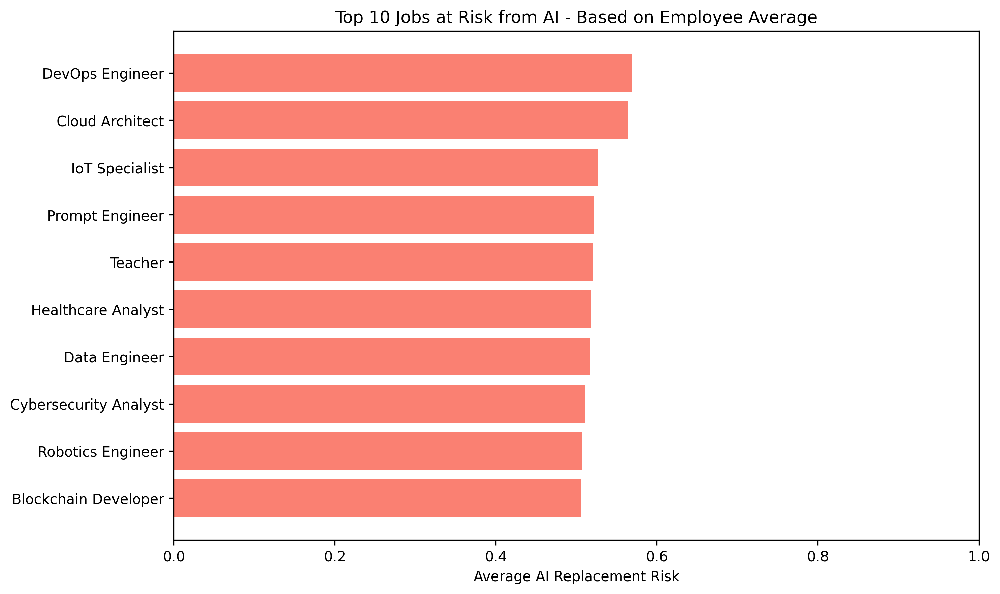
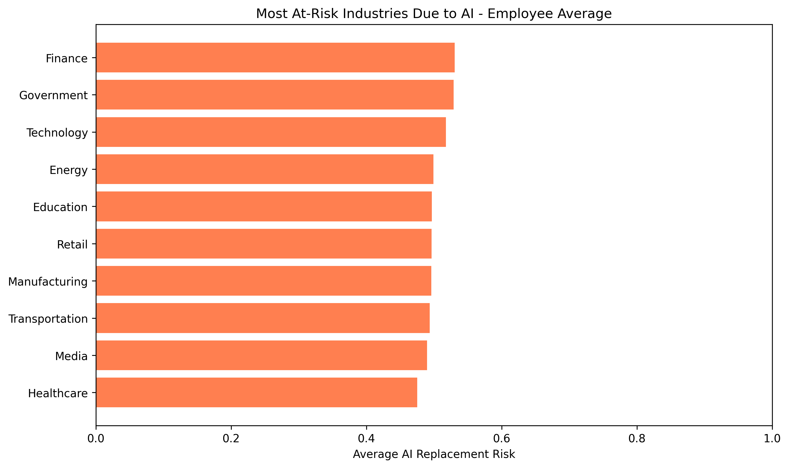
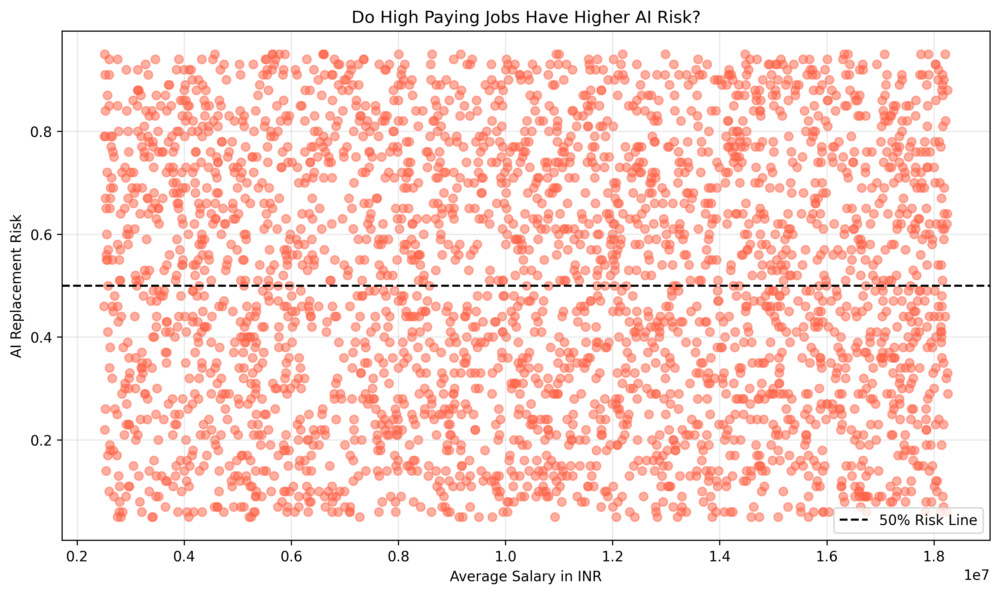

# AI Job Replacement Risk Analysis 2030 🤖📊

This project analyzes 3000+ employee records to identify which jobs and industries are most vulnerable to AI automation by 2030.

## 📌 Key Insights

| Rank | Job Title | Avg AI Risk |
| --- | --- | --- |
| 1 | DevOps Engineer | 56.9% |
| 2 | Teacher | 52.0% |
| 3 | Data Scientist | 50.8% |

**Surprising Finding:** Automation builders like DevOps are at highest risk. Education sector is also highly vulnerable at 52%.

## 🔧 Tools & Libraries Used
- **Python** - Core programming
- **Pandas** - Data manipulation & `groupby` aggregation  
- **Matplotlib** - Data visualization
- **Jupyter Notebook** - Analysis environment

## 🎯 Key Learning
Initial analysis using `nlargest()` was misleading because it showed individual employees. Used `groupby + mean()` to correctly aggregate employee-level data into job-level insights.

**Wrong Approach:** `df.nlargest(10, 'AI_Replacement_Risk')` ❌  
**Correct Approach:** `df.groupby('Job_Title')['AI_Replacement_Risk'].mean()` ✅

## 📊 Visualizations

### 1. Top 10 Jobs at Risk

### 2. Most At-Risk Industries  

### 3. Salary vs AI Risk Correlation

## 🚀 How to Run
1. Clone this repo
2. Install requirements: `pip install pandas matplotlib jupyter`
3. Open `analysis.ipynb` in Jupyter Notebook
4. Run all cells

## 💡 Conclusion
High salary ≠ Low AI risk. Upskilling and working *with* AI is the key to staying relevant in 2030.

---
**Connect with me on LinkedIn** | #DataScience #Python #AI #MachineLearning #DataAnalytics
